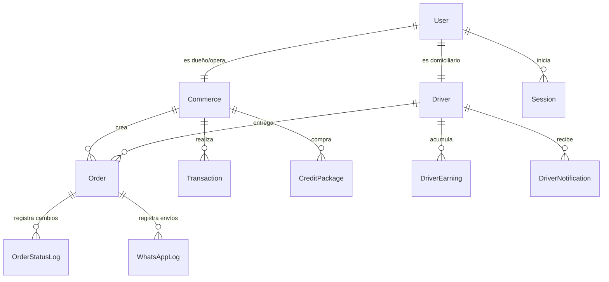

# Pronty — Sistema Profesional de Delivery

> Delivery profesional que reemplaza el caos de grupos de WhatsApp en municipios pequeños de Latinoamérica.

Pronty es una plataforma multi-tenant diseñada para digitalizar, estructurar y profesionalizar el flujo de entregas a domicilio en pequeñas localidades de Latinoamérica (como Colombia o México). Conecta a **Comercios locales** con **Repartidores (Domiciliarios)** en tiempo real, permitiendo a los comercios gestionar sus pedidos desde un panel web moderno y a los repartidores operar al 100% desde WhatsApp, **sin necesidad de descargar o instalar aplicaciones móviles**.

---

## 📌 Tabla de Contenidos

- [🎯 Propósito del Producto](#-propósito-del-producto)
- [✨ Características Principales](#-características-principales)
  - [1. Panel de Comercio (Merchants)](#1-panel-de-comercio-merchants)
  - [2. Bot de WhatsApp para Domiciliarios](#2-bot-de-whatsapp-para-domiciliarios)
  - [3. Panel de Administración Master](#3-panel-de-administración-master)
- [🛠️ Stack Tecnológico](#️-stack-tecnológico)
- [📂 Estructura del Proyecto](#-estructura-del-proyecto)
- [📦 Base de Datos (Esquema Prisma)](#-base-de-datos-esquema-prisma)
- [⚙️ Requisitos de Configuración (.env)](#️-requisitos-de-configuración-env)
- [🚀 Guía de Instalación y Uso](#-guía-de-instalación-y-uso)
- [🔌 Configuración de Webhooks de WhatsApp](#-configuración-de-webhooks-de-whatsapp)
- [🎨 Convenciones de Diseño y Código](#-convenciones-de-diseño-y-código)

---

## 🎯 Propósito del Producto

En los municipios pequeños de Latinoamérica, las plataformas tradicionales como Rappi o iFood no tienen cobertura o cobran comisiones prohibitivas para los pequeños restaurantes y tiendas. Esto ha llevado a que los comercios operen sus domicilios de forma manual a través de caóticos grupos de WhatsApp, perdiendo el control de las tarifas, los tiempos de entrega y la trazabilidad de los pedidos.

**Pronty soluciona esto mediante:**
*   **Eficiencia:** Creación rápida de pedidos y asignación inmediata (directa o por broadcast/grupo).
*   **Cero fricción:** Los domiciliarios no instalan nada. Interactúan con un bot de WhatsApp mediante botones interactivos de Meta Cloud API.
*   **Control Financiero:** Un modelo prepago basado en créditos (1 crédito = 1 pedido de delivery solicitado) y seguimiento exacto del saldo/comisiones de cada domiciliario.
*   **Transparencia:** Trazabilidad de estados en tiempo real (SSE) para el comercio y sus clientes.

---

## ✨ Características Principales

### 1. Panel de Comercio (Merchants)
*   **Gestión Multi-usuario:** Múltiples cuentas por comercio (dueños que administran créditos, empleados que operan la caja y cargan pedidos).
*   **Creación de Pedidos:** Asignación directa a un domiciliario de confianza o por *broadcast* (envío de la oferta a todo el grupo de domiciliarios activos en la zona).
*   **Estados en Tiempo Real:** Actualización de estados del pedido (Pendiente, Aceptado, En camino, Recogido, Entregado, Cancelado) vía Server-Sent Events (SSE).
*   **Monedero de Créditos:** Historial de compras y consumos de créditos prepago.
*   **Métricas y Dashboard:** Panel interactivo con estadísticas de ventas, pedidos mensuales, facturación (en formato COP) y promedios de calificación.

### 2. Bot de WhatsApp para Domiciliarios
*   **Registro Público:** Los domiciliarios pueden postularse en la web (`/drivers/register`) enviando sus datos, tipo de vehículo y zona.
*   **Sistema Conversacional:** Al enviar la palabra `"Hola"`, `"Inicio"` o `"Start"`, el bot interactúa con ellos para activarlos o desactivarlos.
*   **Botones Interactivos:** Aceptación y rechazo de pedidos directamente con botones en WhatsApp (`interactive: { type: "button" }`).
*   **Check-in Automatizado:** Un proceso en segundo plano (cron job) envía un mensaje de confirmación cada 30 minutos a los domiciliarios activos para verificar si siguen en línea o apagarlos automáticamente si no responden.
*   **Monedero e Historial:** Consulta de saldo acumulado, comisiones generadas por carrera y ganancias netas.

### 3. Panel de Administración Master
*   **Control Global:** Acceso exclusivo para el rol `ADMIN_MASTER` (el primer usuario registrado se convierte automáticamente en Master).
*   **Aprobaciones:** Cola de verificación y aprobación manual de nuevos domiciliarios.
*   **Paquetes de Créditos:** Configuración y creación de paquetes prepago para los comercios.
*   **Configuración del Sistema:** Tarifas base globales, comisiones y variables generales almacenadas en la tabla `SystemConfig`.
*   **Logs y Auditoría:** Monitoreo de envíos de correo (Resend), auditoría de logs de transacciones financieras y logs de comunicación de WhatsApp.

---

## 🛠️ Stack Tecnológico

El proyecto está construido sobre un stack moderno que prioriza el rendimiento serverless y la experiencia de usuario:

*   **Framework:** [Next.js 16](https://nextjs.org/) con App Router y Server Components para mayor velocidad de carga y SEO optimizado.
*   **Frontend & Estilos:** [React 19](https://react.dev/), Vanilla CSS con variables avanzadas (sistema de diseño premium *Refined Tech Moderno*), e integración de componentes accesibles mediante `@base-ui/react` y `lucide-react` para iconografía.
*   **Base de Datos & ORM:** [Prisma ORM](https://www.prisma.io/) interactuando con [Neon Serverless PostgreSQL](https://neon.tech/) con soporte para Pooling.
*   **Autenticación:** [Better-Auth 1.7](https://www.better-auth.com/) configurado con el adaptador de Prisma para control de sesiones seguro, tokens y recuperación de contraseñas.
*   **Emails:** [Resend API](https://resend.com/) para envío de correos electrónicos transaccionales (restablecimiento de contraseña).
*   **Motor de Bot:** [Meta Cloud WhatsApp API](https://developers.facebook.com/docs/whatsapp/cloud-api) para envío y recepción de mensajes y plantillas interactivas.

---

## 📂 Estructura del Proyecto

A continuación se muestra la estructura clave de carpetas y archivos en `src/`:

```bash
src/
├── app/                      # Rutas de Next.js (App Router)
│   ├── admin/                # Panel Master Admin (comercios, domiciliarios, reportes, configuraciones)
│   ├── api/                  # Endpoints del backend
│   │   ├── admin/            # Endpoints CRUD para gestión administrativa
│   │   ├── auth/             # Integración y callbacks de Better-Auth
│   │   ├── commerce/         # Métricas y finanzas del comercio
│   │   ├── cron/             # Tareas programadas (ej: check-in del bot)
│   │   ├── drivers/          # Registro público de domiciliarios
│   │   └── webhooks/         # Webhook de Meta para recibir eventos de WhatsApp
│   ├── commerce/             # Vistas específicas del comercio
│   ├── credits/              # Interfaz de recarga de paquetes de créditos
│   ├── dashboard/            # Panel de control de negocios
│   ├── drivers/              # Registro e inducción de domiciliarios
│   ├── orders/               # Creación, listado e historial de pedidos
│   ├── page.tsx              # Landing page principal
│   └── globals.css           # Estilos base y tokens CSS del sistema de diseño
├── components/               # Componentes UI reutilizables
│   ├── admin/                # Componentes específicos de administración
│   ├── layout/               # Estructuras de layout (Sidebar, Header, DashboardLayout)
│   ├── orders/               # Formularios de pedidos y visualizadores
│   └── ui/                   # Primitivas de diseño (Buttons, Dialogs, Tables, Inputs)
├── hooks/                    # React Hooks personalizados (ej: useUser)
└── lib/                      # Configuración de librerías y utilidades
    ├── auth.ts               # Inicialización de Better-Auth
    ├── email.ts              # Envío de correos usando Resend API
    ├── prisma.ts             # Cliente de conexión única de Prisma ORM
    ├── utils.ts              # Helper de clases CSS (cn) y formateo numérico
    └── whatsapp/             # Lógica conversacional y llamadas a la API de Meta
```

---

## 📦 Base de Datos (Esquema Prisma)

La base de datos relacional modela el flujo operativo y financiero de Pronty:



### Modelos Principales
*   **`User`**: Almacena credenciales y roles (`ADMIN_MASTER`, `COMMERCER`, `DRIVER`).
*   **`Commerce`**: Representa el negocio del cliente, su saldo de `credits` prepago y datos de contacto.
*   **`Driver`**: Datos del domiciliario, su estado de disponibilidad (`isAvailable`), aprobación (`isApproved`), saldo acumulado (`balance`) y tasa de comisión (`commissionRate`).
*   **`Order`**: Registro detallado de entrega. Contiene direcciones, coordenadas opcionales, costo de envío (`totalFee`), tipo de asignación (`DIRECT` o `BROADCAST`) y el estado actual (`OrderStatus`).
*   **`Transaction`**: Bitácora financiera de créditos de comercios (Compras, consumos por pedido, reembolsos o ajustes).
*   **`DriverEarning`**: Registro detallado de comisiones ganadas por pedido completado y estado de pago (`PENDING`, `PAID`, `WITHDRAWN`).
*   **`WhatsAppLog`**: Historial de mensajes entrantes y salientes de WhatsApp para depuración y costos de API de Meta.

---

## ⚙️ Requisitos de Configuración (.env)

Crea un archivo `.env` en la raíz del proyecto usando como base el archivo [.env.example](file:///Users/edwar/dev/personal/pronty/.env.example):

```bash
cp .env.example .env
```

Define las siguientes variables obligatorias:

| Variable | Descripción | Ejemplo / Valor |
|----------|-------------|-----------------|
| `DATABASE_URL` | URI de conexión a PostgreSQL (Neon) | `postgresql://...` |
| `BETTER_AUTH_SECRET` | Llave secreta para hashes de sesión | Generado con `openssl rand -hex 32` |
| `BETTER_AUTH_URL` | URL base del servidor de autenticación | `http://localhost:3000` |
| `WHATSAPP_ACCESS_TOKEN` | Token de acceso permanente de Meta Cloud | `EAA...` |
| `WHATSAPP_PHONE_NUMBER_ID` | Identificador del número de teléfono en Meta | `1234567890` |
| `WHATSAPP_BUSINESS_ACCOUNT_ID`| Identificador de la cuenta Business de Meta | `1234567890` |
| `WHATSAPP_VERIFY_TOKEN` | Token de verificación para el Webhook | `pronty-verify-token` |
| `NEXT_PUBLIC_APP_URL` | URL de tu aplicación (cliente) | `http://localhost:3000` |
| `CRON_SECRET` | Token Bearer para asegurar las rutas cron | `un-secret-largo-y-seguro` |
| `RESEND_API_KEY` | Llave de API para envío de correos | `re_...` |
| `EMAIL_FROM` | Dirección remitente autorizada en Resend | `Pronty <onboarding@tu-dominio.com>` |

---

## 🚀 Guía de Instalación y Uso

1.  **Instalar Dependencias**
    Asegúrate de estar usando `pnpm` (versión 11+ recomendada):
    ```bash
    pnpm install
    ```

2.  **Sincronizar Base de Datos**
    Ejecuta las migraciones de Prisma para configurar tu base de datos de Neon:
    ```bash
    npx prisma migrate dev
    ```

3.  **Iniciar Servidor de Desarrollo**
    ```bash
    pnpm dev
    ```
    Abre [http://localhost:3000](http://localhost:3000) en el navegador.

4.  **Crear el Primer Administrador**
    El primer usuario que se registre a través de la ruta `/register` del aplicativo obtendrá automáticamente el rol de `ADMIN_MASTER` gracias al hook `databaseHooks.user.create.after` configurado en `src/lib/auth.ts`. Los registros subsecuentes se guardarán como `COMMERCER` (Comercios).

---

## 🔌 Configuración de Webhooks de WhatsApp

Para conectar Meta Cloud API con tu servidor local en desarrollo:

1.  **Expón tu Puerto Local**
    Usa una herramienta como `ngrok` o `localtunnel` para exponer el puerto `3000`:
    ```bash
    ngrok http 3000
    ```
    Copia la URL segura generada (ej: `https://abcd-123.ngrok-free.app`).

2.  **Configura el Webhook en la Consola de Desarrolladores de Meta (Facebook Developers)**
    *   Ve a la sección de **WhatsApp > Configuración**.
    *   En **Webhook**, haz clic en Editar.
    *   **URL de devolución de llamada:** `https://abcd-123.ngrok-free.app/api/webhooks/whatsapp`
    *   **Token de verificación:** El valor definido en `WHATSAPP_VERIFY_TOKEN` (por defecto: `pronty-verify-token`).
    *   Haz clic en **Verificar y Guardar**.

3.  **Suscríbete a los Eventos de Mensajes**
    *   En la consola de Meta, bajo Webhooks, suscríbete al campo `messages`. Esto permitirá que tu endpoint reciba los mensajes enviados por los domiciliarios.

---

## 🎨 Convenciones de Diseño y Código

### 1. Evitar bugs de Ceros a la Izquierda en Inputs Numéricos
Por convención del proyecto, **nunca** uses `Number(e.target.value) || 0` directamente sobre inputs numéricos en React. Esto produce que ceros a la izquierda queden atrapados en el estado (ej: escribir "200" sobre un "0" inicial produce "0200").

*   **Para Componentes Controlados:** Usa el componente personalizado [NumberInput](file:///Users/edwar/dev/personal/pronty/src/components/ui/number-input.tsx) que maneja un estado string, activa `inputMode="numeric"` y limpia los ceros a la izquierda automáticamente:
    ```tsx
    import { NumberInput } from "@/components/ui/number-input"
    
    <NumberInput
      value={value}
      onValueChange={(v) => update(v)}
    />
    ```
*   **Para Componentes No Controlados:** Procesa la cadena ingresada con el helper `parseNumericInput` exportado en [src/lib/utils.ts](file:///Users/edwar/dev/personal/pronty/src/lib/utils.ts):
    ```ts
    const numericValue = parseNumericInput(event.target.value);
    ```

### 2. Lineamientos del Sistema de Diseño (DESIGN.md)
*   **Visual World:** Minimalista y moderno (inspirado en Stripe/Vercel). Bordes sutiles de `0.6` de opacidad, sombras únicamente en hover/elevaciones y esquinas redondeadas generosas (`1rem` o `16px` para tarjetas).
*   **Paleta de Colores:** Base limpia con neutros cálidos. Azul para acciones primarias, verde para éxitos, y ámbar para advertencias.
*   **Tipografía:** DM Sans para textos limpios y legibles de interfaz, Geist Mono para datos numéricos y códigos de pedidos (`orderNumber`).
*   **Anti-patrones:** Evitar gradientes ruidosos, sombras oscuras en reposo, bordes de 2px o más, y texto en mayúsculas sostenidas en exceso.
